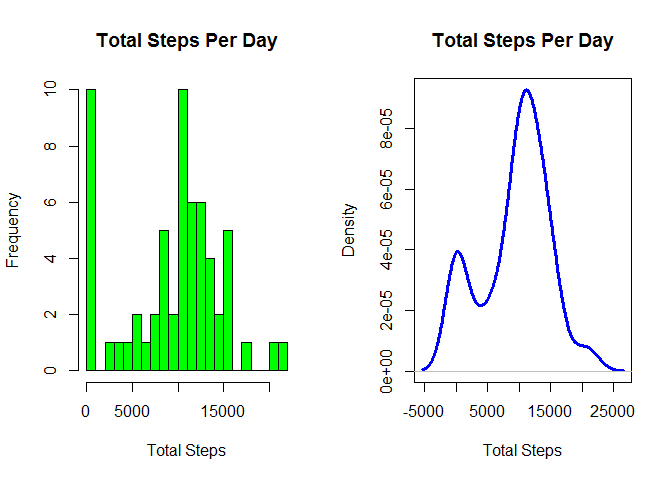
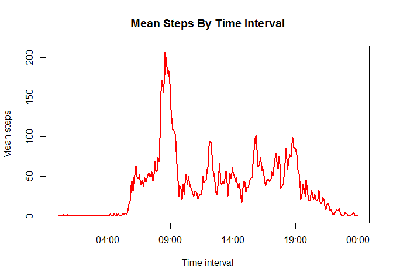
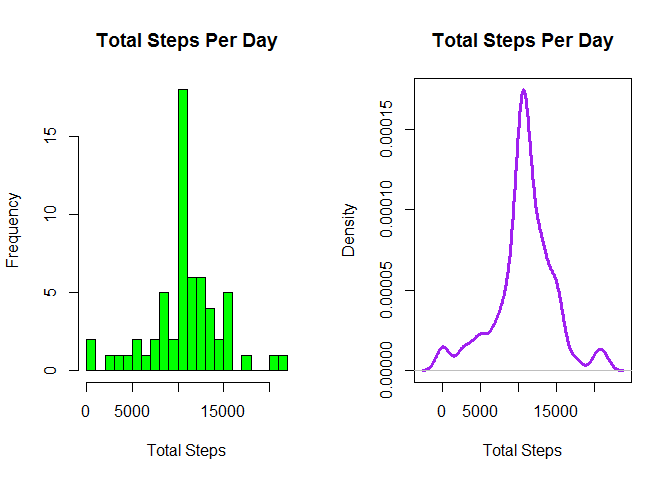
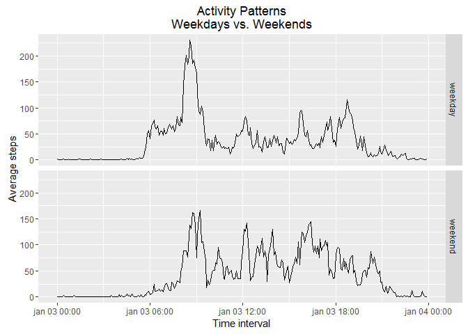

# Reproducible Research: Peer Assessment 1
Carlos Silva  
`r format(Sys.Date(), '%B %d, %Y')`  

##Data

The data for this assignment can be downloaded from the course web site.

Dataset: Activity monitoring data [52K]. 

The variables included in this dataset are:

        steps: Number of steps taking in a 5-minute interval (missing values are coded as NA)

        date: The date on which the measurement was taken in YYYY-MM-DD format

        interval: Identifier for the 5-minute interval in which measurement was taken

The dataset is stored in a comma-separated-value (CSV) file and there are a total of 17,568 observations.


## Loading and preprocessing the data

Load the data (i.e. read.csv())

Process the data into a format suitable for analysis


```r
setwd("C:/Users/Utilizador/Desktop/DataScience/ReproducibleResearch/RepData_PeerAssessment1")
activ <- read.csv("activity.csv", header=TRUE)
activ$date <- as.POSIXct(strptime(activ$date, "%Y-%m-%d"),tz="")
activ$time <- sprintf("%04d", activ$interval)
activ$time <- as.POSIXct(activ$time, "%H%M",tz="")
```


## What is mean total number of steps taken per day?

Ignore the missing values in the dataset

Calculate the total number of steps taken per day

Make a histogram of the total number of steps taken each day

Calculate and report the mean and median of the total number of steps taken per day


```r
#Calculate the total number of steps taken per day
tStepsDay <- aggregate(list(tsteps = activ$steps), by=list(date = activ$date),FUN=sum,
                       na.rm=TRUE)

#Make a histogram of the total number of steps taken each day
# use windows() function to set width and height in advance
options(device = function(file, width = 7, height = 7, ...) {
        windows(width = width, height = height, ...)
})

par(mfrow=c(1,2))
# frequencies
hist(tStepsDay$tsteps, breaks=30, xlab="Total Steps", main="Total Steps Per Day", 
     col = "green")
# desnsity
plot(density(tStepsDay$tsteps, na.rm=TRUE),xlab="Total Steps",ylab="Density",
     main="Total Steps Per Day", col="blue", lwd=3)
```

<!-- -->

```r
#Calculate the mean and median of the total number of steps taken per day
mean(tStepsDay$tsteps)
median(tStepsDay$tsteps,na.rm=T)
```
The mean number of steps each day is 9354

The median number of steps each day is 10395


## What is the average daily activity pattern?

Make a time series plot of the 5-minute interval (x-axis) and the average number of steps taken, averaged across all days (y-axis).

5-minute interval, on average across all the days in the dataset that contains the maximum number of steps.


```r
aStepsTime <- aggregate(list(aSteps = activ$steps),by=list(time = activ$time, 
                        interval = activ$interval),FUN=mean,na.rm=TRUE)
plot(aSteps ~ time,
     data=aStepsTime,
     xlab="Time interval",
     ylab="Mean steps",
     main="Mean Steps By Time Interval",
     type="l",
     col="red",
     lwd=2)
```

<!-- -->

```r
#Determine the time interval with the maximum average number of steps.
aStepsTime[which.max(aStepsTime$aSteps),]
```
The interval with the most steps each day (on average is) : 835


## Imputing missing values

Calculate and report the total number of missing values in the dataset (i.e. the total number of rows with NAs)

Replace the missing values with the median value for that interval

Create a new dataset that is equal to the original dataset but with the missing data filled in

Make a histogram of the total number of steps taken each day and Calculate and report the mean and median total number of steps taken per day


```r
#Obtain a count of missing values in the steps column.
sum(is.na(activ[,"steps"]))
# "join" the two data frames using merge()
activity <- merge(activ,aStepsTime,by="interval")
# correct the NA steps with average steps for the interval
activity<- within(activity, steps <- ifelse(is.na(activity$steps), 
                                            activity$aSteps,
                                            activity$steps))
#Calculate the total number of steps per day with the imputed values.
tStepsDay1 <- aggregate(list(tSteps = activity$steps), by=list(date = activity$date),
                        FUN=sum, na.rm=FALSE)
#Draw histograms showing the distribution of total steps (frequency and density) with the imputed values.
par(mfrow=c(1,2))
# frequencies
hist(tStepsDay1$tSteps,
     breaks=30,
     xlab="Total Steps",
     main="Total Steps Per Day",
     col="green")
# desnsity
plot(density(tStepsDay1$tSteps,
             na.rm=TRUE),
     xlab="Total Steps",
     ylab="Density",
     main="Total Steps Per Day",     
     col="purple",
     lwd=3)
```

<!-- -->

```r
#calculate the mean and median number of steps per day.
mean(tStepsDay1$tSteps)
median(tStepsDay1$tSteps)
```
There are 2304 intervals with NA

The mean and median total number of steps are now equal to one another and higher with the imputed values. Estimates of the total daily number of steps are higher with the imputed values.


## Are there differences in activity patterns between weekdays and weekends?

Create a new factor variable in the dataset with two levels - "weekday" and "weekend" indicating whether a given date is a weekday or weekend day.

Make a panel plot containing a time series plot (i.e. type = "l") of the 5-minute interval (x-axis) and the average number of steps taken, averaged across all weekday days or weekend days (y-axis).


```r
# Add a character column for day of the week
activity$weekday  <- weekdays(activity$date)
# Populate a new factor column using day of the week and a simple function
activity$weekend_indicator <- as.factor(apply(activity["weekday"], 1, function(x) {
        switch(x, "domingo" = "weekend","sábado" = "weekend", "weekday")}))

#Draw a panel plot using ggplot2, comparing activity patterns on weekdays and weekends.
aStepsWeekend <- aggregate(list(aSteps = activity$steps),
                           by=list(time = activity$time.x,daytype = activity$weekend_indicator),
                        FUN=mean)
library(ggplot2)
qplot(x = time,
      y = aSteps,
      geom="path",
      data = aStepsWeekend, 
      xlab="Time interval",
      ylab="Average steps",
      main="Activity Patterns\nWeekdays vs. Weekends",
      facets = daytype ~ .)
```

<!-- -->

steps are higher on the weekend, although the maximum for steps is highest on 
weekday mornings. Weekend activity is more variable.
